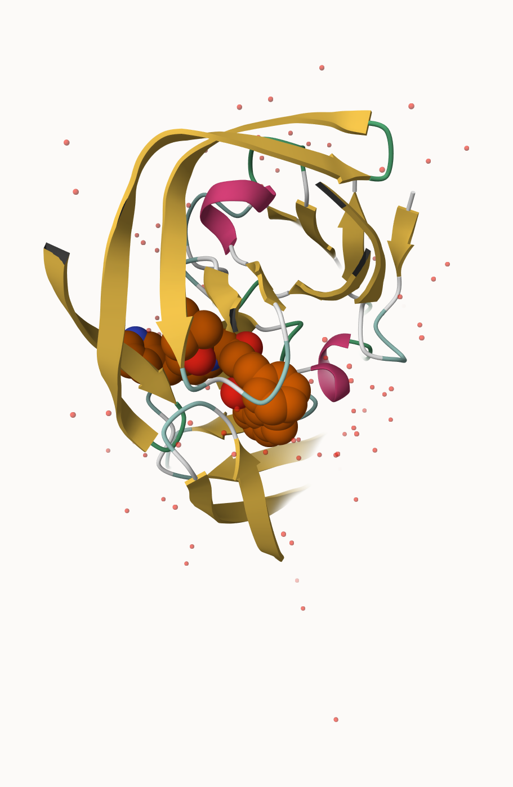
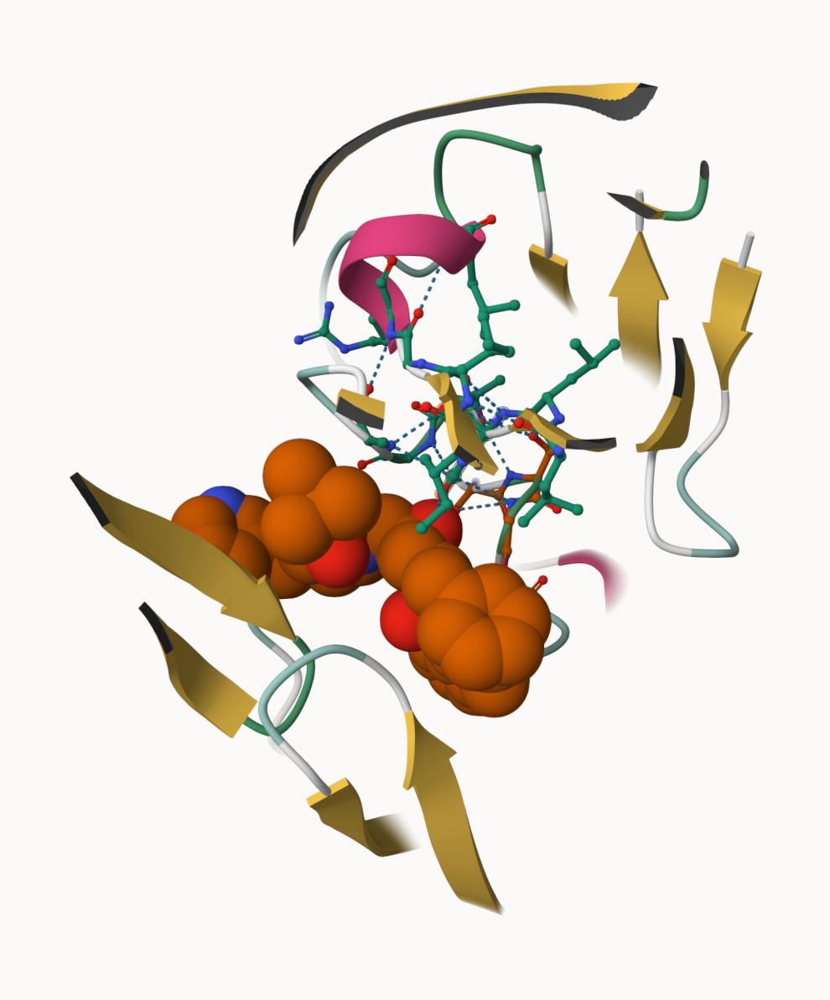

```{r}
library(readr)
db <- read_csv("pdb_stats.csv")
```

**>Q1: What percentage of structures in the PDB are solved by X-Ray and Electron Microscopy.**

```{r}
total <- sum(db$Total)
(sum(db$`X-ray`) / total) * 100
(sum(db$EM) / total) * 100
```
According to the data on RCSB, 80.48% of structures in the PDB are solved by X-ray, 13.78% are solved by electron microscopy.

**>Q2: What proportion of structures in the PDB are protein?**

```{r}
sum(db$Total[1:3]) / total
```

**>Q3: Type HIV in the PDB website search box on the home page and determine how many HIV-1 protease structures are in the current PDB?**

After typing HIV in the main search and putting HIV-1 protase, 1227 structures are present in the database.

> The PDB Frmat

```{r}
library(bio3d)
pdb <- read.pdb("1HSG.pdb.txt")
print(pdb)
```

**>Q4: Water molecules normally have 3 atoms. Why do we see just one atom per water molecule in this structure?**

In protein structures like 1HSG, only one atom, typically an oxygen, for each water moelcule is seen. This is likely due to limits in resolution and inability to see hydrogen atoms. This is because hydrogen has only one electron causing it to behard to be seen. Hydrogen atoms are also disordered, contantly moving, and disorded particles are not very visibile in the final models.

**>Q5: There is a critical “conserved” water molecule in the binding site. Can you identify this water molecule? What residue number does this water molecule have**

The conserved water molecule in the binding site is known to be flap water. The residue number is usually 301. It is noticed as it acts as a bridge between the flaps of the protease and the ligand.

**> Q6: Generate and save a figure clearly showing the two distinct chains of HIV-protease along with the ligand. You might also consider showing the catalytic residues ASP 25 in each chain and the critical water (we recommend “Ball & Stick” for these side-chains). Add this figure to your Quarto document.**





> Introduction to Bio3D in R

```{r}
library(bio3d)
pdb <- read.pdb("1hsg")
pdb
```

**>Q7: How many amino acid residues are there in this pdb object?**

198 amino acid residues are there in this pdb object.

**>Q8: Name one of the two non-protein residues?** 

HOH and MK1 are the two non-protein residues/

**>Q9: How many protein chains are in this structure?** 

2 protein chains are in this structure.

Note that the attributes (+ attr:) of this object are listed on the last couple of lines. To find the attributes of any such object you can use:
```{r}
attributes(pdb)
```

To access these individual attributes we use the dollar-attribute name convention that is common with R list objects. For example, to access the atom attribute or component use pdb$atom:
```{r}
head(pdb$atom)
```

The returned NGLVieweR object can be further added to build custom interactive visualizations:

```{r}
library(bio3dview)
library(NGLVieweR)

view.pdb(pdb) |>
  setSpin()
```

You can also customize the display in many ways with minimal code. For example, lets custom color the chains and highlight some key residues as spacefill/vdw:

```{r}
sele <- atom.select(pdb, resno=25)
view.pdb(pdb, cols=c("navy","teal"), 
         highlight = sele,
         highlight.style = "spacefill") |>
  setRock()
```

> Predicting functional motions of a single structure

Let’s read a new PDB structure of Adenylate Kinase and perform Normal mode analysis.
```{r}
adk <- read.pdb("6s36")
adk
```

Normal mode analysis (NMA) is a structural bioinformatics method to predict protein flexibility and potential functional motions (a.k.a. conformational changes).

```{r}
m <- nma(adk)
```

```{r}
plot(m)
```

To view a “movie” of these predicted motions we can generate a molecular “trajectory” with the mktrj() function.

```{r}
mktrj(m, file="adk_m7.pdb")
```

For a quicker display you can use the view.nma() function from the bio3dview package mentioned previously:

```{r}
view.nma(m, pdb=adk)
```

**>Q10. Which of the packages above is found only on BioConductor and not CRAN?** 

The packages above is found only on BioConductor and not CRAN is msa isntead of the standard.

**>Q11. Which of the above packages is not found on BioConductor or CRAN?:**

The above packages that is not found on BioConductor or CRAN is bio3dview.

**>Q12. True or False? Functions from the pak package can be used to install packages from GitHub and BitBucket?** 

Tue, Functions from the pak package can be used to install packages from GitHub and BitBucket.

>Search and retrieve ADK structures

```{r}
library(bio3d)
aa <- get.seq("1ake_A")
aa
```

**>Q13. How many amino acids are in this sequence, i.e. how long is this sequence? **

```{r}
hits <- NULL
hits$pdb.id <- c('1AKE_A','6S36_A','6RZE_A','3HPR_A','1E4V_A','5EJE_A','1E4Y_A','3X2S_A','6HAP_A','6HAM_A','4K46_A','3GMT_A','4PZL_A')

```

We can now use function get.pdb() and pdbslit() to fetch and parse the identified structures

```{r}
files <- get.pdb(hits$pdb.id, path="pdbs", split=TRUE, gzip=TRUE)

```

> Align and superpose structures

Next we will use the pdbaln() function to align and also optionally fit (i.e. superpose) the identified PDB structures

```{r}
# Align releated PDBs
pdbs <- pdbaln(files, fit = TRUE, exefile="msa")
```

> Annotate collected PDB structures

```{r}
# Vector containing PDB database codes
ids <- basename.pdb(pdbs$id)

anno <- pdb.annotate(ids)
unique(anno$source)
anno
```

> Principal component analysis

PCA can be performed on the structural ensemble (stored in the pdbs object) with the function pca.xyz(), or more simply pca().

```{r}
# Perform PCA
pc.xray <- pca(pdbs)
plot(pc.xray)
```

Function rmsd() will calculate all pairwise RMSD values of the structural ensemble. This facilitates clustering analysis based on the pairwise structural deviation:

```{r}
# Calculate RMSD
rd <- rmsd(pdbs)

# Structure-based clustering
hc.rd <- hclust(dist(rd))
grps.rd <- cutree(hc.rd, k=3)

plot(pc.xray, 1:2, col="grey50", bg=grps.rd, pch=21, cex=1)
```

> PCA visualization

```{r}
# Visualize first principal component
pc1 <- mktrj(pc.xray, pc=1, file="pc_1.pdb")
```

We can also plot our main PCA results with ggplot:

```{r}
#Plotting results with ggplot2
library(ggplot2)
library(ggrepel)
df <- data.frame(PC1=pc.xray$z[,1], 
                 PC2=pc.xray$z[,2], 
                 col=as.factor(grps.rd),
                 ids=ids)

p <- ggplot(df) + 
  aes(PC1, PC2, col=col, label=ids) +
  geom_point(size=2) +
  geom_text_repel(max.overlaps = 20) +
  theme(legend.position = "none")
p
```

