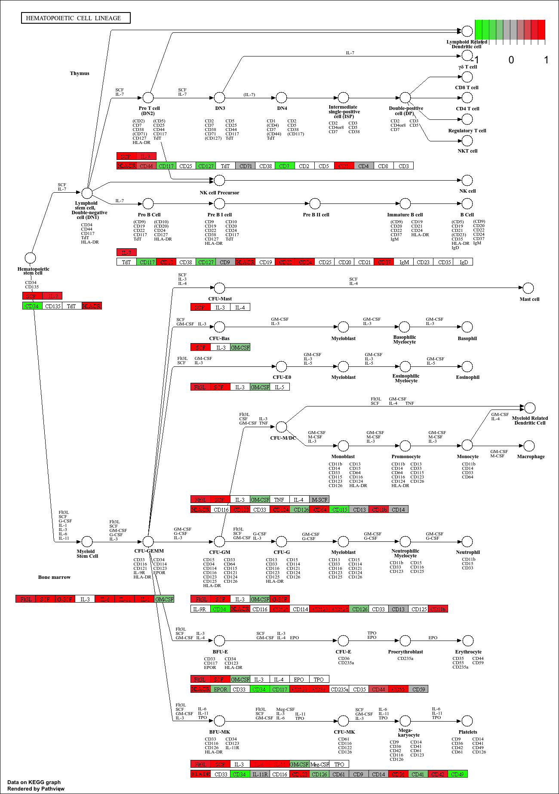
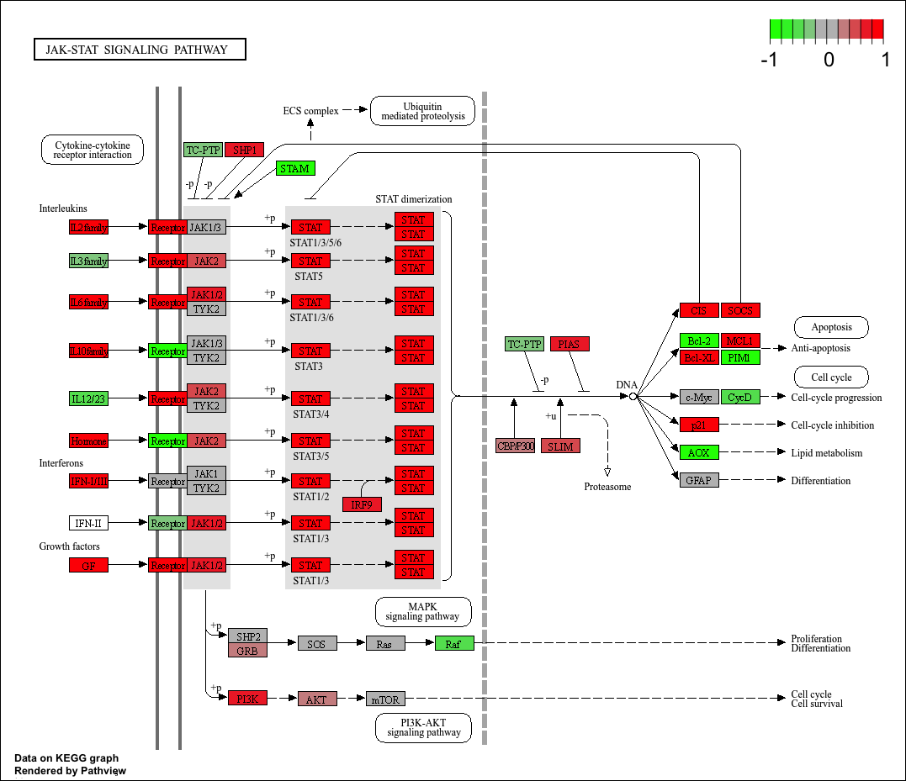
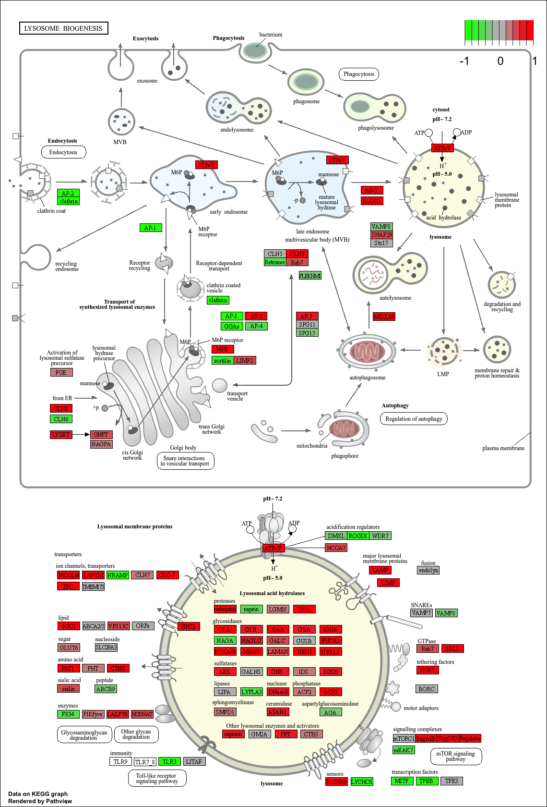
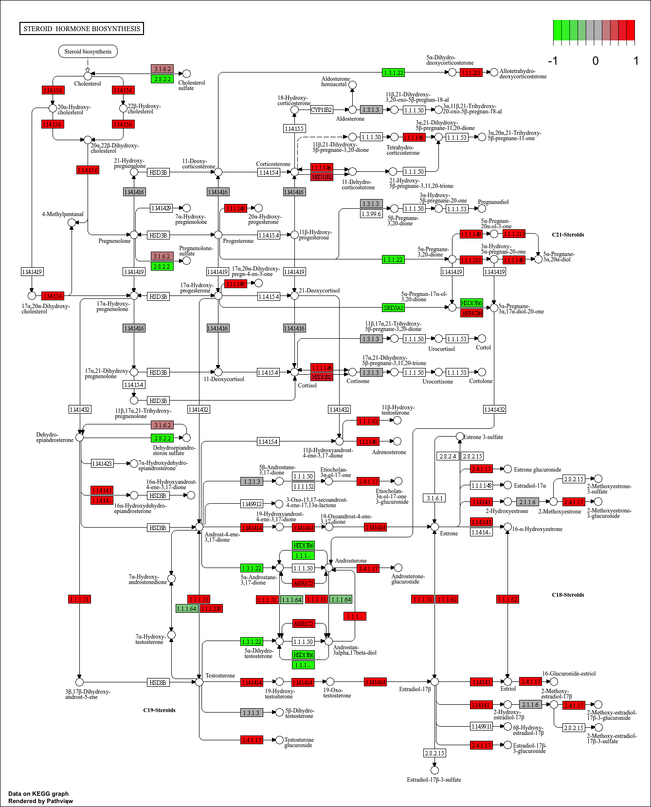
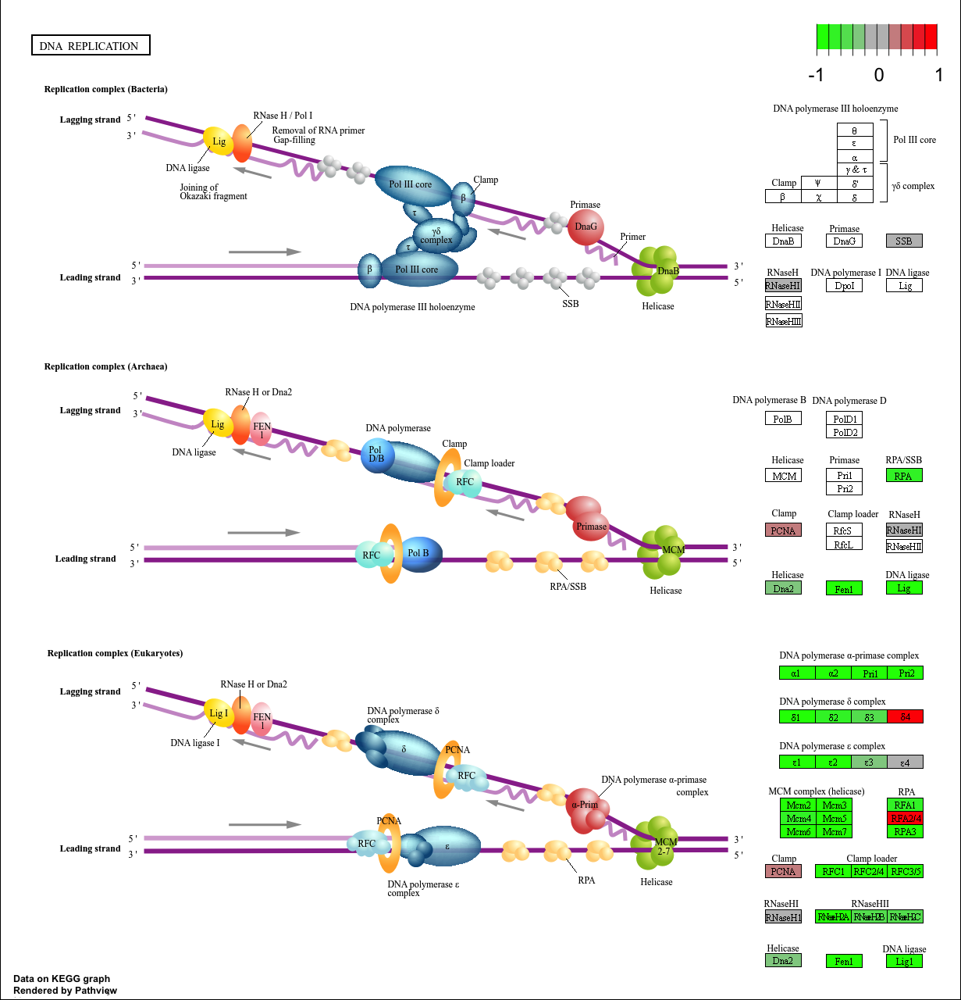

Section 1. Differential Expression Analysis

Load our data files

```{r}
library(DESeq2)
metaFile <- "GSE37704_metadata.csv"
countFile <- "GSE37704_featurecounts.csv"

colData = read.csv(metaFile, row.names=1)
head(colData)
```

```{r}
# Import countdata
countData = read.csv(countFile, row.names=1)
head(countData)
```

>**Q. Complete the code below to remove the troublesome first column from countData**

```{r}
countData <- as.matrix(countData[,-1])
head(countData)
```

>**Q. Complete the code below to filter countData to exclude genes (i.e. rows) where we have 0 read count across all samples (i.e. columns).?**

```{r}
countData = countData[rowSums(countData) > 1, ]
head(countData)
```

Running DESeq2
Nice now lets setup the DESeqDataSet object required for the DESeq() function and then run the DESeq pipeline. This is again similar to our last day's hands-on session.

```{r}
dds = DESeqDataSetFromMatrix(countData=countData,
                             colData=colData,
                             design=~condition)
dds = DESeq(dds)
dds
```

Next, get results for the HoxA1 knockdown versus control siRNA (remember that these were labeled as "hoxa1_kd" and "control_sirna" in our original colData metaFile input to DESeq, you can check this above and by running resultsNames(dds) command).

```{r}
res = results(dds)
```

>**Q. Call the summary() function on your results to get a sense of how many genes are up or down-regulated at the default 0.1 p-value cutoff.**

```{r}
summary(res)
```

Volcano Plot

```{r}
library(ggplot2)

ggplot(as.data.frame(res)) +
  aes(log2FoldChange, 
      -log10(padj)) +
  geom_point()
```

>**Q. Improve this plot by completing the below code, which adds color, axis labels and cutoff lines:**

```{r}
mycols <- rep("gray", nrow(res))

mycols[ abs(res$log2FoldChange) > 2 ] <- "blue"

mycols[ res$padj > 0.01 ] <- "gray"

ggplot(as.data.frame(res)) +
  aes(log2FoldChange, 
      -log10(padj)) +
  geom_point(col=mycols) +
  xlab("Log2(FoldChange)") +
  ylab("-Log(P-value)") +
  geom_vline(xintercept = c(-2,2)) +
  geom_hline(yintercept = -log10(0.01))
```

Adding gene annotation

>**Q. Use the mapIDs() function multiple times to add SYMBOL, ENTREZID and GENENAME annotation to our results by completing the code below.**

```{r}
library("AnnotationDbi")
library("org.Hs.eg.db")

columns(org.Hs.eg.db)

res$symbol = mapIds(org.Hs.eg.db,
                    keys=row.names(res), 
                    keytype="ENSEMBL",
                    column="SYMBOL",
                    multiVals="first")

res$entrez = mapIds(org.Hs.eg.db,
                    keys=row.names(res),
                    keytype="ENSEMBL",
                    column="ENTREZID",
                    multiVals="first")

res$name =   mapIds(org.Hs.eg.db,
                    keys=row.names(res),
                    keytype="ENSEMBL",
                    column="GENENAME",
                    multiVals="first")

head(res, 10)
```

>**Q. Finally for this section let's reorder these results by adjusted p-value and save them to a CSV file in your current project directory.**

```{r}
res = res[order(res$pvalue),]
write.csv(res, file="deseq_results.csv")
```

Section 2. Pathway Analysis

```{r}
library(pathview)
library(gage)
library(gageData)

data(kegg.sets.hs)
data(sigmet.idx.hs)

# Focus on signaling and metabolic pathways only
kegg.sets.hs = kegg.sets.hs[sigmet.idx.hs]

# Examine the first 3 pathways
head(kegg.sets.hs, 3)
```

```{r}
foldchanges = res$log2FoldChange
names(foldchanges) = res$entrez
head(foldchanges)
```

Let’s run the gage pathway analysis

```{r}
keggres = gage(foldchanges, gsets=kegg.sets.hs)
```

Lets look at the object returned from gage()

```{r}
attributes(keggres)
```

Lets look at the first few down (less) pathway results:

```{r}
head(keggres$less)
```

Now, let's try out the pathview() function from the pathview package to make a pathway plot with our RNA-Seq expression results shown in color

```{r}
pathview(gene.data=foldchanges, pathway.id="hsa04110")
```


A different PDF based output of the same data

```{r}
pathview(gene.data=foldchanges, pathway.id="hsa04110", kegg.native=FALSE)
```

Let's process our results a bit more to automagicaly pull out the top 5 upregulated pathways, then further process that just to get the pathway IDs needed by the pathview() function

```{r}

keggrespathways <- rownames(keggres$greater)[1:5]

keggresids = substr(keggrespathways, start=1, stop=8)
keggresids
```

Lets pass these IDs in keggresids to the pathview() function to draw plots for all the top 5 pathways

```{r}
pathview(gene.data=foldchanges, pathway.id=keggresids, species="hsa")
```

>**Q. Can you do the same procedure as above to plot the pathview figures for the top 5 down-regulated pathways?**

```{r}
keggrespathways_down <- rownames(keggres$less)[1:5]
keggresids_down = substr(keggrespathways_down, start=1, stop=8)
keggresids_down
pathview(gene.data=foldchanges,
         pathway.id=keggresids_down,
         species="hsa")
```












Section 3. Gene Ontology (GO)

```{r}
data(go.sets.hs)
data(go.subs.hs)
gobpsets = go.sets.hs[go.subs.hs$BP]
gobpres = gage(foldchanges, gsets=gobpsets)
lapply(gobpres, head)
```

Section 4. Reactome Analysis

```{r}
sig_genes <- res[res$padj <= 0.05 & !is.na(res$padj), "symbol"]
print(paste("Total number of significant genes:", length(sig_genes)))
```

```{r}
write.table(sig_genes, file="significant_genes.txt", row.names=FALSE, col.names=FALSE, quote=FALSE)
```

>**Q: What pathway has the most significant “Entities p-value”? Do the most significant pathways listed match your previous KEGG results? What factors could cause differences between the two methods?**

The pathway that has the most significant entities p-value was cell cycle, m phase and mitosis, or DNA replication, or chromosome segregation. The most significant pathways listed match the previous KEGG results (when looking at the data, they appeared to be toard the top of the downregulated list). Some factors that could cause differences between the two methods includes data use data (the computer receieved all our info while the website used data it had), KEGG is more big and broad while reactome is smaller scaled data graphing. 
